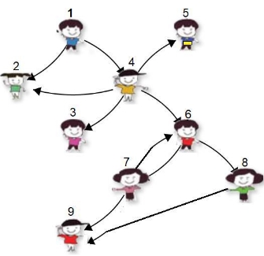

**CS 218 DATA STRUCTURES ASSIGNMENT 2** 

**SECTION A, B, C and D Fall 2019** 

**DUE**: 7th October 2019 

**NOTE:** Late submissions will not be accepted 

**TO SUBMIT:** Documented and well written structured code in C++ on classroom.  Undocumented code will be assigned a zero. The name of your file should be your NUCES roll number. 

**PROBLEM BACKGROUND - SOCIAL NETWORK INFLUENCE COUNTER** 

In this modern era of technology and virtualization people are connected through online social networks and communities like Facebook, Twitter, etc. The social networks has revolutionized the way people communicate and socialize on the web. An individual in a social network can influence the way of thinking and perception of the other individuals in the same social network, with whom he is directly or indirectly connected.  

**The person with high social influence is of great significance in today’s social world.** The more **influence** a person has, the more appeal he has to companies or other individuals who want to promote an idea or sell a product. 

|

**Social Influence Network** 
|
Consider a social network of N persons with ids from 1-N.  

**Person 6** can influence **7** and **8** directly and **9** indirectly. So, we can say **6** can influence **7, 8** and **9**, total three individuals.  

**Person 4** can influence **2, 3, 5, 6, 7, 8, 9. It** can influence seven individuals. 

**Person 1** can influence eight individuals.  Note: **1** can influence **2** directly and as well as through **4**.  

**2,  3,  5,  9**  do  not  have  ability  to  influence anyone.  
|
| - | :- |
**ASSIGNMENT DETAILS** 

In this assignment, your task is to calculate the social Influence of a person in an Influence network.   **INPUT** 

You will be given a text file, containing details about the Influence network. 

Example: The above network will be represented as follows in the text file  

|
**Input File organization:** 

**Total number of persons**  

**ID** of the Person – Comma separated list of individuals he is Directly Connected to 

You can assume that  
|
| - |
|
9 

1 – 2, 4 

2 –  

3 – 

4 – 2, 3, 5, 6 5 – 

6 – 7, 8 

7 – 6, 9 

8 – 9 

9– 
|
**You will load the above information in a linked structure as follows** 

1  2  4 2

3 4  2  3  5  6 5

6   7  8
6   6  9
6   9

9

` `**IMPLEMENT:** 

\1.  Build a **template based Singly linked list** in C++. It should consist of following classes with appropriate data members, constructors and destructor 

1. Node 
1. Single Linked List (SLL) 
1. Iterator (It should be implemented as Nested class within SSL. The SSL can be friend of Iterator class.) 
- Overload the following operators in the Iterator classes 
1. operator++, prefix 
1. operator++, postfix 
1. operator== 
1. operator\* 
1. operator!= 
2. Implement **template and Single linked list based Stack class. The stack class can only have following members** 
1. Constructors  
1. Destructor 
1. Push: push an element on the top of stack 
1. Pop: pop an element from the top of the stack 
1. TopElement: return the top element without removing it from stack 
1. IsEmpty 
1. IsFull 

`    `Note: **Stack class cannot have search function or iterator.**  

3. **Implement class InfluenceNetwork. The class will have following functionality** 
1. Array of singly linked lists to store the network 
1. Constructors  
1. Destructor 
1. Input: A function to input the network from a file into the array of SLLs 
1. **Calculate\_Influence:** A function that calculates the influence of each person in the network.  
- This function will print the number of individuals influenced by each person directly or indirectly. Also print the ids of the individuals influenced by each person.  
- It should also print the id of the person who influence the maximum number of individuals. 
- This function should use Stack to calculate the Influence.  

**Important Note: The Stack, SLL and InfluenceNetwork classes cannot be friend of one- another.**

|**Input** |**Influence Network** |**Output of function CalculateInfluence** |
| - | - | - |
|
9 

1 – 2, 4 

2 –  

3 – 

4 – 2, 3, 5, 6 5 – 

6 – 7, 8 

7 – 6, 9 

8 – 9 

9 –** 
||
1

2

3

4

5

6

7 8

9
|
- 2  4

- 2  3  5  6

- 7  8

- 6  9

- 9
|
**1 influence 8 persons 2, 3, 4, 5, 6, 7, 8, 9** 

**2 influence 0 person 3 influence 0 person** 

**4 influence 7 persons 2, 3, 5, 6, 7, 8, 9** 

**5 influence 0 person** 

**6 influence 3 persons 7, 8, 9** 

**7 influence 3 persons 6, 8, 9** 

**8 influence 1 person 9** 

**9 influence 0 person** 
|
||
**The person 6 influence 7 and 8 directly and 9 indirectly. Use stack to find the individuals influenced indirectly by a person.** 

**Note that when you are finding individuals indirectly influenced by a Person then you can reach to an individual more than once. For example, in the above example Person 6 can influence 9 through 7 and as well as through 8. You will count 9 once.**  

**Use a mechanism to memorize that you have calculated 9 once so you do don’t count it again and don’t push it on stack again. Otherwise you will be stuck in a never ending loop.** *Hint: You can use an array of bool of size N for this purpose.***  
|
**VERY IMPORTANT** 

- Academic integrity is expected of all the students. Plagiarism or cheating in any assessment will result in negative marking or an **F** grade in the course, and possibly more severe penalties. 
